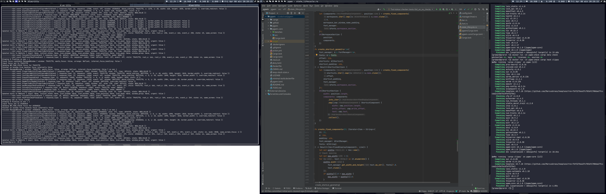
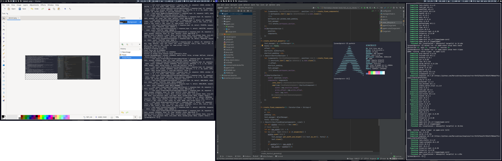
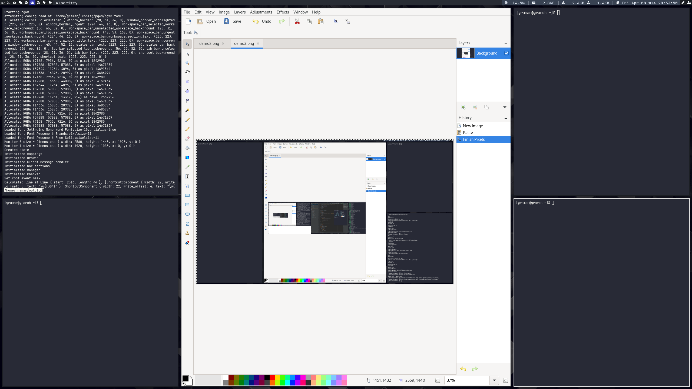

# PGWM, a DWM-inspired tiling window manager written in pure Rust
[](https://github.com/MarcusGrass/pgwm/actions)

The WM is to my understanding compliant with the [wm-spec](https://specifications.freedesktop.org/wm-spec/wm-spec-1.3.html).
The specification is fairly difficult to understand (for me) and for a tiling window manager some sometimes liberal
interpretations has to be made. If something seems implemented wrongly, and it isn't covered by
an explanation in [EWMH.md](docs/EWMH.md), please create an issue if you have the time.
Big shout out to [x11rb](https://github.com/psychon/x11rb) which has great safe x11 bindings!

Even Jetbrains IDE's work without freaking out assuming `setwmname LG3D` is in your `~/.xinitrc`.


# Why
I love to build my old tools, so after a few years of running up against bugs that bothered my workflow 
and features that I wanted but were missing in other tiling WMs
I decided to build a WM that does exactly what I want it to do. I considered hacking dwm, but I'm not that hot with 
`C` and decided against it, opting to write it in Rust instead. 

# Primary goals
A WM that is fast, has low resource-usage, is feature complete according to my needs,
doesn't contain nasty bugs or QoL-detriments, and is ewmh-compliant.

# Implemented features
- Crashes on errors (yes this is a feature)
- It can tile windows in a left-leader or center-leader pattern
- It can display windows tabbed with the window title on top
- Windows are configured into workspaces
- Workspaces can be moved between monitors
- Workspace-layouts can be cycled (left-leader -> center-leader -> tabbed)
- Windows within workspaces can have their order rearranged
- Windows can be moved between workspaces
- When a window is moved from a workspace it ends up at the first tab-order
- Windows can be manually floated
- Floating windows can be dragged
- Windows can be manually un-floated
- It hosts a bar at the top of each monitor
- Sections of the bar can have their on-click behaviour customized
- The bar can be hidden
- The displays workspace information, window title name, status-checks, and shortcuts
- Windows can be resized
- Visible cursor without window supplying it
- Most of the window-manipulation that the WM does can be configured
- Keys (or clickable sections of the bar) can be configured to run arbitrary processes (some custom bash for example)
- Windows can be mapped to workspaces by their `WM_CLASS` property

# Comparison to other WMs
I'm only comparing other WMs which I have used extensively hopefully I can extend this to include more than 2 other WMs.

## DWM
The closest WM in terms of feature-parity would be DWM, although this WM tries to do a bit more by default than DWM does.
A major difference between this WM and DWM is that instead of using tags with
different tags per monitor this WM operates closer to DWM's [single tagset patch](https://dwm.suckless.org/patches/single_tagset/).

## Xmonad
The beauty of xmonad and using haskel for a configurable WM is that through a functional language Xmonad provides
an absurd level of customizability, this lends itself well to contributors creating additions through xmonad-contrib.
This WM does not aim to match that level of customizability but instead tries to be minimal and reasonably configurable,
while also being distributable and configurable through a binary rather than compiled-configuration. Something like [penrose](https://github.com/sminez/penrose) 
is likely what you're looking for if you want something more Xmonad-like.

# Usage
Some getting-started information is described [here](docs/USAGE.md).

# Future plans
As far as features go the plan is not to add complicated features, but simple flexible things. The WM is now 
according to my needs feature complete. However, I most likely don't know what I'm missing, if there's a feature 
that you'd like to see I'd love to hear about it and will consider adding it, but I am fairly conservative when it 
comes to adding features that I wouldn't use, the best place for those would be a fork.
When it comes to ergonomics and documentation I'm very open to add things. One big thing is the configuration,
it's a simplest possible mapping, almost 1 to 1 to internal datastructures which makes it cumbersome.
Instead of configuring a status check in one place, and then a mouse-mapping on click for it in another 
something more reasonable might be to configure a status check and in the same place some on-click action, things like that.
I've been hesitant about working too much on configuration ergonomics since I don't know if there is any demand for that, 
if there is, please let me know by creating an issue.

# How it looks
### Default config, tabbed on the left, left-leader-layout on the right.

### Default config, left-leader-layout on the left, a floating window on the right, above the left-leader-layout

### Default config, single monitor center-leader


# How to build
To build locally, platform build essentials is required
see the [min building dockerfile](.docker/minimal-build.dockerfile).  
To run the same test as the ci locally, libssl and perl is also required, 
[see the ci dockerfile](.docker/full-checks.dockerfile).

The project is tested on x86_64-unknown-linux-gnu but "should" run on more *nix systems. 

## Install a Rust toolchain
https://www.rust-lang.org/tools/install

## Clone this repo
git clone https://github.com/MarcusGrass/pgwm.git

## Build the project
As of 0.3.0 the WM runs in pure Rust with no libc dependencies. In effect this means that the binary will always be 
statically linked. It also sadly means that some use of unsafety is needed.
Mostly this comes from direct syscalls, which will always be unsafe, as well as the WM entrypoint since we don't include start files.

Another side effect of this is that a target needs to be specified for build-scripts in dependencies to run correctly 
since the binary will be statically linked anyway it just defaults to --target x86_64-unknown-linux-gnu in [the build script](build_wm.sh).

`lld` is required, if you don't want to change [the small build script](build_wm.sh) and remove it as the default linker there.

The project builds default with xinerama support, and a status-bar. To compile without either,
disable default features.
To build with max optimizations use --profile=lto.
In [config.toml](.cargo/config.toml) --release is set to compile with debug assertions, usually when I'm developing 
the WM I run it like that to ensure that there are no overflows/underflows, x11 uses i16s, u16s, i32s, and u32s fairly interchangeably 
which poses a conversion risk. Removing that option will yield a negligible performance increase if compiling --release.    
In benchmarking, heavier calculations see a speedup of around 15-45% on lto compared to release on my machine, 
that being said we're talking about 190 to 150 nanoseconds for calculating tiling positions, there aren't many heavy calculations
being performed, most latency is from x11 redrawing windows.  
The project can also be compiled with debug output, the binary will then output various debug info to stderr.

### Using make
There's a [configure script](configure) for convenience, although it's basically just
a silly posix-shell script that generates a Makefile.

If no binary directory is supplied, the script will try to install to `$HOME/.local/bin`, 
if the environment variable `$HOME` is not set and no binary directory is supplied the script will fail.  
if your path variable doesn't include that directory you can export that for example in your `~/.bashrc` 
with: `export PATH=$HOME/.local/bin:$PATH`, if you want the wm to be launchable by just `pgwm`.  

  
Build default:  
```shell
./configure
make
make install
# Cleans up build directory
make clean
```
Use `./configure --help` to see options, by default uninstall does not remove the configuration file, the full lifecycle from nothing
to a clean uninstall would be
```shell
./configure
make
make install
make clean
# Uninstall and remove config
make uninstall CLEAN_CONFIG=1
```

### Manual build
How to build as a regular Rust project.

#### With default features
`./build_wm.sh -r`
or
`./build_wm.sh --profile=lto`

#### With no default features
`./build_wm.sh --release --no-default-features`
or
`./build_wm.sh --profile=lto --no-default-features`

#### Example of some additional features
`./build_wm.sh --release --no-default-features --features xinerama,status-bar`  
or  
`./build_wm.sh --profile=lto --no-default-features --features xinerama,status-bar`

### Edit .xinitrc or other file specifying WM entrypoint
If built with `./build_wm.sh` The binary ends up in target/x86_64-unknown-linux-gnu/release/pgwm or target/x86_64-unknown-linux-gnu/lto/pgwm
Replace the (probably) last line of .xinitrc with
`exec $BINARY_LOCATION` $BINARY_LOCATION being the path to the pgwm binary.     

# Changing configuration
Configuration resides in [pgwm_core/src/config/mod.rs](pgwm-core/src/config/mod.rs) and consists of rust code.
The configuration is mostly constants with some functions, some constants are limits, such as `WS_WINDOW_LIMIT`,
the reason for it existing is that a lot of heapless datastructures are used.
If you were to set the `WS_WINDOW_LIMIT` to 2, and try to spawn 3 windows on a workspace, the application would crash.
A rule of thumb for the error-handling is that all errors which are unexpected immediately causes a crash, and every crash
signifies a misconfiguration or programming error. The reason for keeping it this way is so that bugs doesn't go by silently.
If something causes a crash I want to fix the issue rather than have the application limp along. 
If you decide to try this WM out and find a bug, please report it as an issue in this repo or make a PR if you have the time.  

Note: A crash here is a rust `panic`, the WM should never segfault, regardless of misconfiguration. If it does please 
file an issue.

# Easy mistakes to make
There are a few easy mistakes to make that will make the WM run strangely. 
- The configured fonts do not exist on the machine. The default configuration of this WM is one that I use, and if you do not
have the same fonts as I do the results will be weird. Update the default configuration to use a font that exists on the machine.
`fc-list` will find available fonts.
- Misconfiguration causing startup issues, if the issues start after increasing something, more fonts, more keybinds etc.
Then most likely a hardcoded limit has been reached, either create an Issue to increase the limit, recompile it yourself with a higher limit, 
or make a PR with the limit increased. Limits are found [with the hardcoded configuration](pgwm-core/src/config/mod.rs).
- Fewer defined workspaces than amount of monitors will result in unused monitors
- If running some applications built on java frameworks, such as Jetbrains IDE's, 
putting the below lines in your `~/.xinitrc` may be required for them to work properly.
```Bash
export _JAVA_AWT_WM_NONREPARENTING=1
export AWT_TOOLKIT=MToolkit
wmname compiz # or wmname LG3D
```

# Resources
The WM, according to `smem` on glibc, has a USS/PSS/RSS of around 2M when built for musl with the lto profile and no known leaks,
a memory leak would likely result in a crash rather than a slow increase over time since most dynamic
data structures are on the stack.  
CPU-wise it has a fairly low usage, with idle usage that depends completely on whether you use the status bar, what update frequency you're
running it on, and which checks you're using. Running the full checks on a 1 second interval as I am doing currently draws very little cpu.

Some update-intensive operations will cause cpu-spikes, such as dragging a floating window. For each motion-event coming from x11
the WM reconfigures the window. The same thing will occur if resizing tiled windows, each resize will cause a reconfiguration
of windows in that tile-set.

Some programs like Jetbrains IDEs update the WM name on every keystroke, depending on
typing speed this may result in a lot of events and workspace bar redraws. However, that operation is so CPU-efficient that it isn't worth
making an effort to reduce workspace bar redraws on name-changes by caching or otherwise.

Some examples to get a feel for the resource usage (the WM runs single threaded):  
At idle with no status bar I get a 0% single-core CPU usage, with status bar it spikes about once a second to 0.6%.  
An extremely violent window drag results in an at most 10% single-core CPU usage.  
Furious typing into a Jetbrains IDE gets at most 1.3% single-core CPU usage.

All this being said, it's measured for the running WM binary, all operations on the x11-server will cause some overhead there,
this WM binary could be perfectly efficient but slamming the x11 server with requests that it has problems processing.
Although I have not noticed any such behaviour.

Note: post migration, pre rip out libc, 931K binary size

# Licensing
This project is licensed under [GPL v3](GPL-LICENSE)